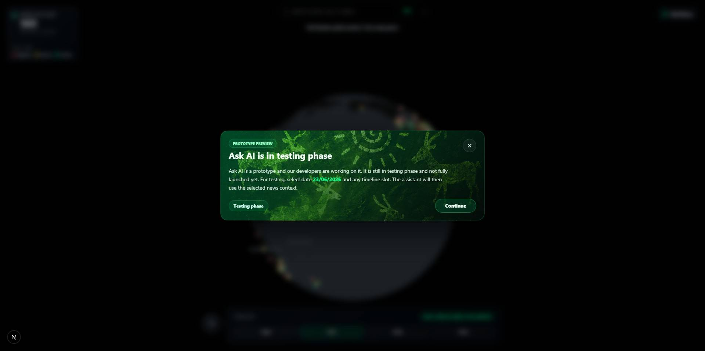
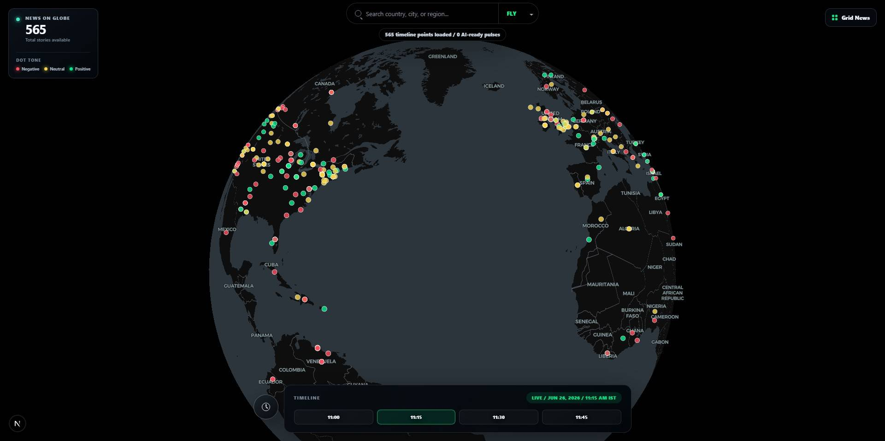
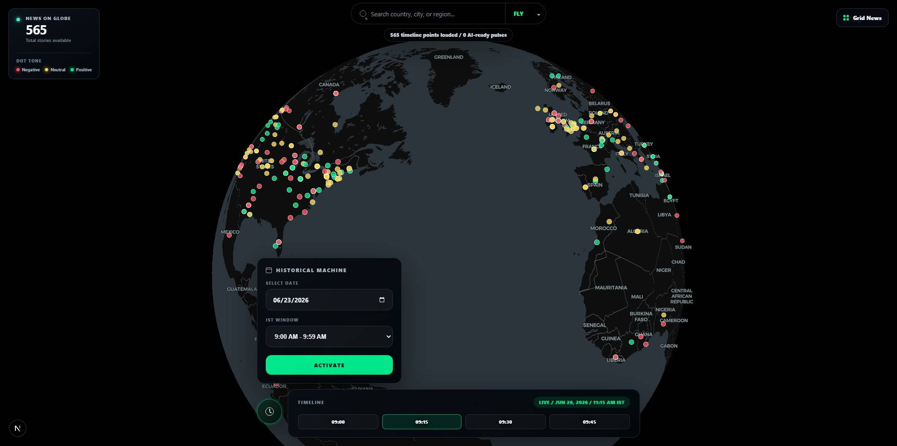
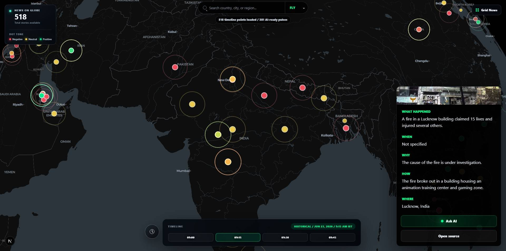
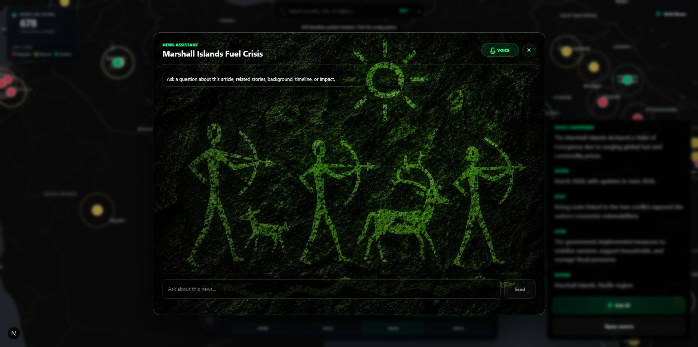

# Globe News Advance

Globe News Advance is a real-time and historical news intelligence application. It places geolocated news stories on an interactive 3D globe, highlights AI-ready stories with animated ripple markers, generates structured article summaries, and lets users ask follow-up questions about a selected news ripple through text or live voice.

The app is designed around one core workflow: click a news point, understand the event quickly, then ask deeper questions using the selected article, timeline, location, embeddings, and backend memory as context.

## Screenshots

Captured UI states are included below for quick reference.

<table>
  <tr>
    <td align="center">
      
      <br />
      <sub>Startup prototype notice</sub>
    </td>
    <td align="center">
      
      <br />
      <sub>Live globe overview</sub>
    </td>
  </tr>
  <tr>
    <td align="center">
      
      <br />
      <sub>Historical timeline controls</sub>
    </td>
    <td align="center">
      
      <br />
      <sub>News detail card with Ask AI entry</sub>
    </td>
  </tr>
  <tr>
    <td align="center" colspan="2">
      
      <br />
      <sub>Ask AI modal background and layout</sub>
    </td>
  </tr>
</table>

## Core Features

- Interactive 3D globe powered by MapLibre GL.
- Dark map and Esri satellite basemap modes.
- Live timeline loading from the latest completed 15-minute IST news slot.
- Historical news controls for date, hour, and 15-minute window selection.
- Up to 1,000 timeline stories per request.
- Tone-colored news dots:
  - Red: negative tone
  - Yellow: neutral tone
  - Green: positive tone
- AI-ready ripple animation for stories where `has_embedding` and `ai_ready` are true.
- Clickable news detail card with AI-generated article summary.
- Multilingual article summaries in 60+ languages.
- Ask AI modal for selected AI-ready ripple stories.
- Text chat connected to the backend `ask_news` intelligence API.
- Realtime voice assistant connected through WebRTC and an `ask_news` tool call.
- Grid News page for card-based browsing and filtering.
- Location search, geocoding, and reverse geocoding through Mapbox.
- Server-side API routes to keep private keys and Azure Function codes out of browser code.

## How The App Works

1. The frontend requests timeline news from `GET /api/timeline-news`.
2. The server-side route calls the Azure GDELT timeline function and returns geolocated stories.
3. The globe renders each story as a colored point.
4. If a story has both embeddings and AI readiness, it receives a ripple animation.
5. The user clicks a news point.
6. The app opens the news detail card and calls `POST /api/article-details`.
7. Article content is extracted through Firecrawl and summarized by Azure OpenAI.
8. If the selected story is AI-ready, the user can open Ask AI.
9. Text questions go to `POST /api/ask-news`.
10. Voice questions go through Azure Realtime WebRTC, which calls the frontend `ask_news` tool.
11. The frontend tool handler calls `POST /api/ask-news` with the selected news context.
12. Realtime speaks the backend answer naturally.

## AI-Ready Ripple Logic

Timeline items may include these fields:

```ts
has_embedding | hasEmbedding
ai_ready | aiReady
```

When both values are true, the point becomes AI-ready:

- it receives a pulsing/rippling visual effect on the globe;
- the selected story can open the Ask AI chat;
- the voice assistant receives selected-ripple context;
- user questions are routed through the backend `ask_news` API.

## Ask AI Text Flow

When a user asks a typed question in the Ask AI modal, the frontend sends:

```json
{
  "session_id": "user_hash_20260624094500_urlhash",
  "question": "What happened after that?",
  "title": "AI generated title",
  "articleSummary": {
    "whatHappened": "...",
    "when": "...",
    "where": "...",
    "why": "...",
    "how": "..."
  },
  "source": "source name",
  "url": "article url",
  "date": "2026-06-24",
  "timestamp": "20260624094500",
  "place": "news place",
  "country": "news country",
  "lat": 0,
  "lon": 0,
  "top_k": 8
}
```

`session_id` is deterministic for the selected ripple so follow-up questions can use backend memory.

## Realtime Voice Flow

The voice assistant uses Azure/OpenAI Realtime WebRTC for live audio. Realtime remains the conversational voice layer, but the news intelligence comes from the backend `ask_news` API.

Professional flow:

```text
User voice
  -> Azure Realtime WebRTC
  -> Realtime tool call: ask_news
  -> Frontend receives tool call event
  -> Frontend calls /api/ask-news with selected ripple context
  -> Frontend sends function_call_output back to Realtime
  -> Realtime speaks final answer
```

Realtime is configured with an `ask_news` function tool. The tool receives the user's spoken question, and the frontend attaches the selected news context before calling the backend.

## Multilingual Article Summaries

The news detail card supports summaries in 60+ languages, including:

- English, Hindi, Urdu, Arabic, Bengali, Tamil, Telugu, Marathi, Gujarati, Punjabi
- Kannada, Malayalam, Odia, Assamese, Nepali, Sinhala, Burmese, Thai, Vietnamese
- Chinese, Japanese, Korean, Indonesian, Malay, Filipino
- Spanish, French, German, Italian, Portuguese, Russian, Ukrainian, Polish, Dutch
- Turkish, Persian, Hebrew, Greek, Romanian, Czech, Hungarian, Bulgarian, Croatian
- Swahili, Amharic, Hausa, Yoruba, Zulu

Changing the language reloads the selected article summary through `POST /api/article-details`.

## API Routes

| Route | Method | Purpose |
| --- | --- | --- |
| `/api/timeline-news?date=YYYY-MM-DD&time=HH:mm` | GET | Loads timeline news from the Azure GDELT timeline function. |
| `/api/article-details` | POST | Extracts article content with Firecrawl and generates a structured AI summary with Azure OpenAI. |
| `/api/ask-news` | POST | Proxies selected-ripple questions to the backend news intelligence API. |
| `/api/realtime-token` | GET | Requests an ephemeral Realtime token and WebRTC URL from the backend token function. |
| `/api/geocode?query=<place>` | GET | Searches locations through Mapbox forward geocoding. |
| `/api/reverse-geocode?lng=<lng>&lat=<lat>` | GET | Converts coordinates into a place name through Mapbox reverse geocoding. |

## Environment Variables

Create `.env.local` from `.env.example`:

```bash
cp .env.example .env.local
```

On Windows PowerShell:

```powershell
Copy-Item .env.example .env.local
```

Required variables:

```env
MAPBOX_ACCESS_TOKEN=your_mapbox_token_here
TIMELINE_NEWS_CODE=your_timeline_news_code_here
FIRECRAWL_API_KEY=your_firecrawl_api_key_here
AZURE_OPENAI_CHAT_URL=https://your-resource.openai.azure.com/openai/deployments/your-deployment/chat/completions?api-version=2025-01-01-preview
AZURE_OPENAI_API_KEY=your_azure_openai_api_key_here
ASK_NEWS_URL=https://your-function.azurewebsites.net/api/ask_news
ASK_NEWS_CODE=your_ask_news_code_here
REALTIME_TOKEN_URL=https://your-function.azurewebsites.net/api/realtime_token
REALTIME_TOKEN_CODE=your_realtime_token_code_here
```

### Variable Details

| Variable | Required | Used By | Description |
| --- | --- | --- | --- |
| `MAPBOX_ACCESS_TOKEN` | Yes | `/api/geocode`, `/api/reverse-geocode` | Mapbox token for place search and reverse geocoding. |
| `TIMELINE_NEWS_CODE` | Yes | `/api/timeline-news` | Azure Function code for the timeline news endpoint. |
| `FIRECRAWL_API_KEY` | Yes | `/api/article-details` | Firecrawl API key for article extraction. |
| `AZURE_OPENAI_CHAT_URL` | Yes | `/api/article-details` | Azure OpenAI chat completions endpoint for article summaries. |
| `AZURE_OPENAI_API_KEY` | Yes | `/api/article-details` | Azure OpenAI API key. |
| `ASK_NEWS_URL` | Recommended | `/api/ask-news` | Backend ask-news endpoint. Defaults to the project Azure endpoint if omitted. |
| `ASK_NEWS_CODE` | Yes for secured Azure Function | `/api/ask-news` | Azure Function code for ask-news. Added server-side only. |
| `REALTIME_TOKEN_URL` | Recommended | `/api/realtime-token` | Backend endpoint that returns Realtime `client_secret` and `webrtc_url`. |
| `REALTIME_TOKEN_CODE` | Optional if URL already includes code | `/api/realtime-token` | Azure Function code for realtime token endpoint. |

Never commit `.env.local` or real secret values. The repository `.gitignore` excludes local env files.

## Local Development

Install dependencies:

```bash
npm install
```

Start the development server:

```bash
npm run dev
```

Open:

```text
http://localhost:3000
```

Run validation:

```bash
npm run lint
npm run build
```

## Available Scripts

| Command | Description |
| --- | --- |
| `npm run dev` | Starts the Next.js development server. |
| `npm run build` | Builds the production app. |
| `npm run start` | Runs the production build. |
| `npm run lint` | Runs ESLint. |

## Project Structure

```text
src/
  app/
    api/
      article-details/       Firecrawl + Azure OpenAI article summary route
      ask-news/              Backend news intelligence proxy
      geocode/               Mapbox forward geocoding proxy
      realtime-token/        Realtime ephemeral token proxy
      reverse-geocode/       Mapbox reverse geocoding proxy
      timeline-news/         Azure GDELT timeline proxy
    grid-news/               Grid-based timeline news browser
    globals.css              Global styles
    layout.tsx               Root app layout
    page.tsx                 Globe page
  components/
    GridNewsView.tsx         Grid News UI
    LocationSearch.tsx       Location search and basemap controls
    MapView.tsx              Globe, timeline, article card, Ask AI, voice assistant
public/
  bg.png                     Ask AI modal background image
```

## External Services

The app depends on:

- Azure-hosted GDELT timeline function
- Azure-hosted ask-news intelligence function
- Azure-hosted realtime-token function
- Azure OpenAI chat completions
- Firecrawl article extraction
- Mapbox Geocoding API
- CARTO Dark Matter map tiles
- Esri World Imagery satellite tiles

## Deployment Checklist

Before deploying:

1. Add all required env variables to the hosting provider.
2. Confirm Azure Function codes are not hardcoded in source files.
3. Run:

```bash
npm run lint
npm run build
```

4. Verify these routes return successful responses:

```text
GET /api/timeline-news?date=YYYY-MM-DD&time=HH:mm
POST /api/article-details
POST /api/ask-news
GET /api/realtime-token
```

5. Test a live AI-ready ripple:
   - click a pulsing news point;
   - wait for the AI-generated title and summary;
   - open Ask AI;
   - ask a typed question;
   - start Voice and ask a spoken follow-up.

## Troubleshooting

### Timeline points do not load

- Check `TIMELINE_NEWS_CODE`.
- Confirm the selected date uses `YYYY-MM-DD`.
- Confirm the selected time uses a 15-minute slot such as `09:45`.

### Location search fails

- Check `MAPBOX_ACCESS_TOKEN`.
- Confirm the token has access to Mapbox geocoding.

### Article summary fails

- Check `FIRECRAWL_API_KEY`.
- Check `AZURE_OPENAI_CHAT_URL`.
- Check `AZURE_OPENAI_API_KEY`.
- Some source pages may block scraping or contain no readable article text.

### Ask AI does not answer

- Check `ASK_NEWS_URL`.
- Check `ASK_NEWS_CODE`.
- In the browser Network tab, confirm `POST /api/ask-news` is called.
- Confirm the selected story has `has_embedding` and `ai_ready`.

### Voice does not connect

- Check `REALTIME_TOKEN_URL`.
- Check `REALTIME_TOKEN_CODE` if the code is not already included in `REALTIME_TOKEN_URL`.
- Confirm `/api/realtime-token` returns `client_secret` and `webrtc_url`.
- Allow microphone access in the browser.

### Voice answers without using backend

- Open the browser console.
- Look for Realtime function-call events:
  - `response.function_call_arguments.done`
  - `response.output_item.done`
- Confirm Network shows `POST /api/ask-news`.
- If no backend request appears, inspect the Realtime session tool configuration in `MapView.tsx`.

## Security Notes

- Do not expose Azure Function codes in frontend code.
- Do not commit `.env.local`.
- Do not paste real API keys into README files, issues, screenshots, or commit messages.
- Server-side routes should remain the only place where provider credentials are attached.

## License

This project is private unless a license is added.
